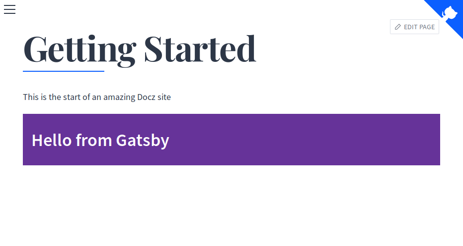

# Gatsby Starter with Docz

A [GatsbyJS](https://www.gatsbyjs.org/) starter with support for [Docz](https://www.docz.site/).

This starter is forked from [gatsby-starter-default](https://github.com/gatsbyjs/gatsby-starter-default).

Live Demos:

- Gatsby site: https://gatsby-starter-docz.netlify.com/
- Docz site: https://gatsby-starter-docz-docz.netlify.com/

## Description

Writing good documentation is important for your project maintainers (and for your future self!). A very nice documentation generator is [Docz](https://www.docz.site). It supports `mdx` files, which is short for Markdown with JSX. That means you can render React components in these special Markdown files. It can generate Prop tables and even provide a coding playground for your components!

That means you can show and document all your different Gatsby components in a nice and organised way.

> Note: This starter generates the same default Gatsby site as if you just use [gatsby-starter-default](https://github.com/gatsbyjs/gatsby-starter-default).

## Known Limitations

This starter only works with React components not rendering any `StaticQuery` components from Gatsby. That means any component containing some kind of GraphQL logic cannot be rendered in your documentation files.

## Getting Started

Assuming you have `npx` installed (that is the case if you are using version 5.2.0 or greater of `npm`), run

```
npx gatsby-cli new [GATSBY_PROJECT_NAME] https://github.com/RobinCsl/gatsby-starter-docz
```

You can then run the Gatsby site with

```
npm run develop
```

and you can go to http://localhost:8000 to see it.

You can also admire your generated documentation with

```
npm run docz:dev
```

It will be available at http://localhost:3000.


_Showcasing the Header component from Gatsby_

For more information about writing documentation with Docz, consult their official [guide](https://www.docz.site/introduction).

## Deploying the documentation

To build the documentation, run

```
npm run docz:build
```

The resulting build is by default in `.docz/dist`.

## Authors

- Robin Cussol [@RobinCsl](https://github.com/RobinCsl)

## Contributing

To contribute, follow the usual workflow on GitHub. A great guide is available [here](https://github.com/asmeurer/git-workflow). A TL;DR is:

- Clone the repository
  ```
  git clone https://github.com/RobinCsl/gatsby-starter-docz.git
  ```
- Fork it to your personal account
- Add your fork as a remote on the cloned repository
  ```
  git remote add <your username> https://github.com/<your username>/gatsby-starter-docz.git
  ```
- Create your feature branch
  ```
  git checkout -b feature/adding-awesomeness
  ```
- Commit your changes
  ```
  git commit -am 'Feat: Added awesomeness'
  ```
- Push to the branch
  ```
  git push <your username> feature/adding-awesomeness
  ```
- Create a new Pull Request through GitHub's interface.

### Commit message convention

Commit messages should contain a proper description, once you open a PR it will be added automatically to the PR description.

Commit messages should be prefixed with one of the following to signify the kind of change:

- Fix: bug fixes, e.g. fix some colors, paddings.
- Feat: new features, e.g. add new component.
- Refactor: code/structure refactor, e.g. new structure folder for components/ extracting component to separate file.
- Docs: changes into documentation,
- Test: adding or updating tests, e.g. unit, snapshot testing.
- Chore: tooling changes, e.g. change circle ci config.
- BREAKING: for changes that break existing usage, e.g. change API of a component.

To make this easier, please run the following command:

```
git config --local commit.template commit-template.txt
```

This will pre-fill your commit message with a template whenever you run `git commit`, reminding you to follow the convention and to add a summary.

## Licence

The MIT License (MIT)

Copyright (c) 2015 gatsbyjs
Copyright (c) 2019 RobinCsl

Permission is hereby granted, free of charge, to any person obtaining a copy
of this software and associated documentation files (the "Software"), to deal
in the Software without restriction, including without limitation the rights
to use, copy, modify, merge, publish, distribute, sublicense, and/or sell
copies of the Software, and to permit persons to whom the Software is
furnished to do so, subject to the following conditions:

The above copyright notice and this permission notice shall be included in all
copies or substantial portions of the Software.

THE SOFTWARE IS PROVIDED "AS IS", WITHOUT WARRANTY OF ANY KIND, EXPRESS OR
IMPLIED, INCLUDING BUT NOT LIMITED TO THE WARRANTIES OF MERCHANTABILITY,
FITNESS FOR A PARTICULAR PURPOSE AND NONINFRINGEMENT. IN NO EVENT SHALL THE
AUTHORS OR COPYRIGHT HOLDERS BE LIABLE FOR ANY CLAIM, DAMAGES OR OTHER
LIABILITY, WHETHER IN AN ACTION OF CONTRACT, TORT OR OTHERWISE, ARISING FROM,
OUT OF OR IN CONNECTION WITH THE SOFTWARE OR THE USE OR OTHER DEALINGS IN THE
SOFTWARE.
